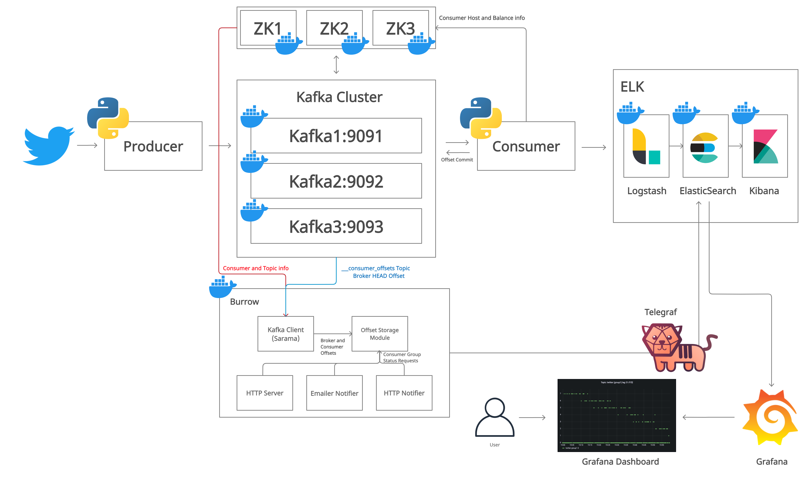
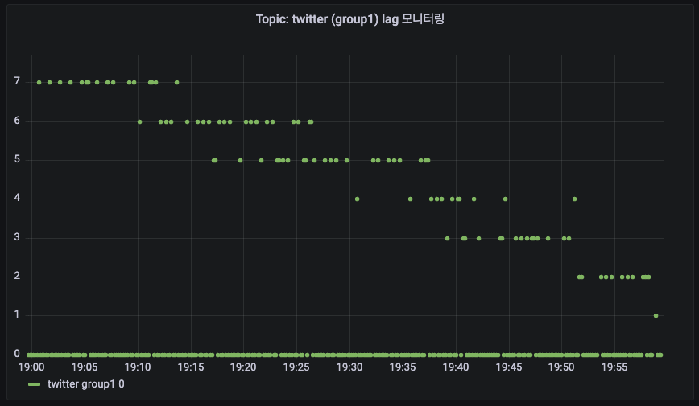
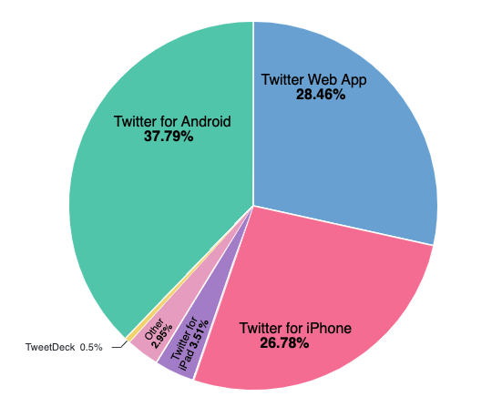
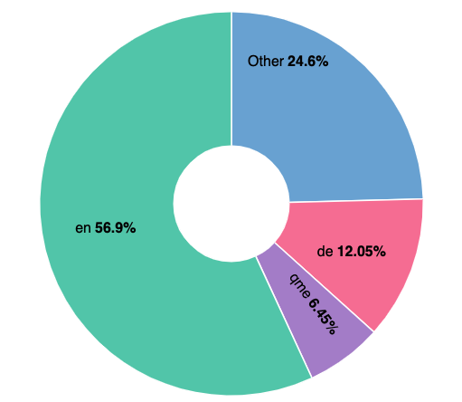
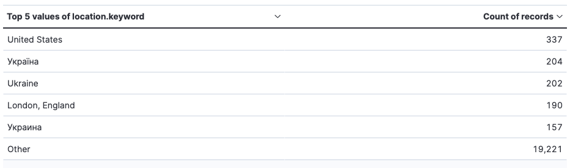
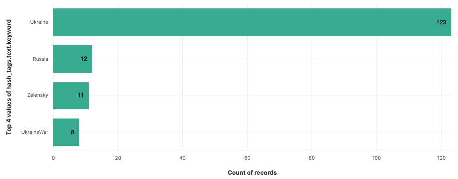
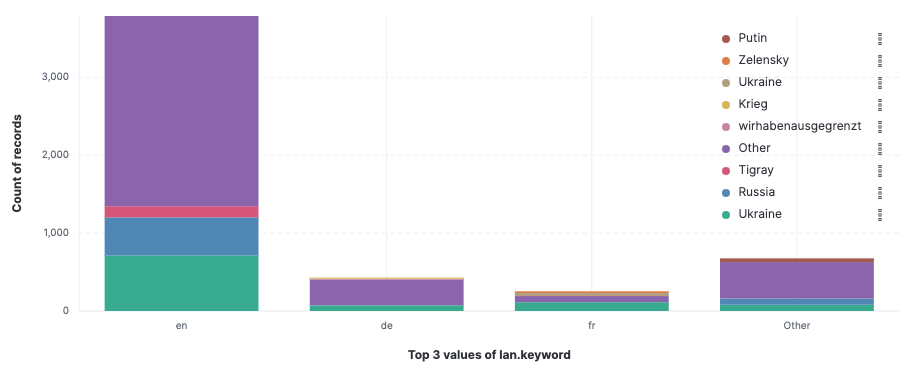
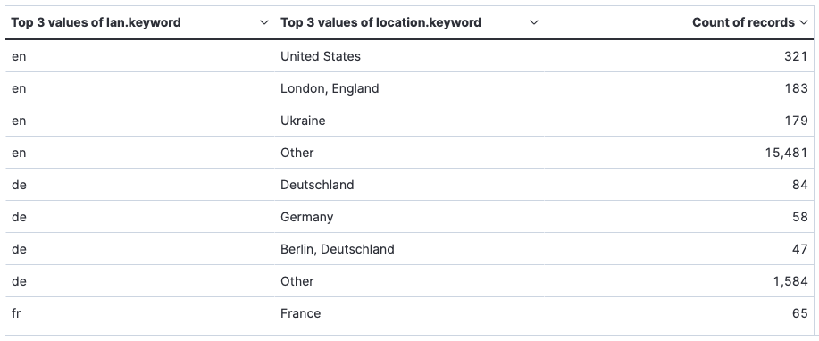
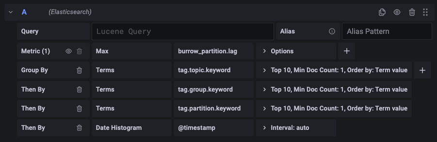

# **Kafka를 활용한 실시간 Twitter log 데이터 분석 및 시각화**

## **Overview**

이번 프로젝트에서는 로컬 환경에서 docker로 Kafka 클러스터를 구성하고, Consumer에서 ELK 스택의 docker 컨테이너로 데이터를 전송 및 처리되는 구조로 구성하여, 실시간으로 전송되는 Twitter 로그 데이터가 처리하도록 하였습니다. 

더 나아가 Kafka Consumer lag를 모니터링하기 위해서 Burrow를 구성하고, Burrow의 데이터를 시각화하기 위해 Telegraf를 통해 ES에 Burrow의 데이터를 적재하여, Grafana를 통해 시각화하여 대시보드를 구성하도록 하였습니다.

이전에 구축하였던 온/습도 센서 데이터를 실시간으로 받아서 처리하는 파이프라인에서는 데이터 파이프라인의 복잡도가 증가(`Kinesis data stream의 producer와 consumer가 증가`)됨에 따라 발생될 수 있는 문제로, Kinesis data stream 서비스 사용에 대한 비용증가 문제가 있었는데, 그 해결책으로 `직접 Kafka를 구축해서 운영`하거나 `AWS의 MSK(Kafka 완전 관리형) 서비스를 사용하여 관리 및 운영`하는 해결책에 대해서 정리를 했었는데, 이번에는 그 중에서 직접 Kafka를 로컬 환경에서 직접 구축하여 실시간 로그 데이터 처리 및 모니터링을 할 수 있도록 구성해보았습니다. 

## **Dataset**

프로젝트에서 사용하게 될 데이터는 Twitter API로부터 취득한 로그 데이터를 사용할 것 입니다. 

## **Objective**

이번 프로젝트를 통해서 데이터셋을 분석 및 시각화를 통하여 아래의 내용들에 대해 확인해볼 것 입니다.

### **[Netflix 관련 트윗 데이터 실시간 분석]**

- Burrow에서 ES에 적재된 데이터
- 수집된 트윗의 레코드 수
- 트윗을 작성한 사용자 단말기 정보
- 수집된 트윗의 사용자 언어 정보
- 수집된 트윗의 사용자 국가 정보
- 수집된 트윗의 해시태그 정보
- 수집된 트윗의 해시태그와 언어 간의 관계
- 수집된 트윗의 언어와 국가 간의 관계

<br/>

## **Data Architecture**



### **(1) Kafka를 선택한 이유**

이번 프로젝트에서 docker를 사용하여, 로컬 환경에 Kafka cluster를 구성한 이유는 Kafka 자체가 고가용성(HA)을 잘 지원해주기 때문에 실시간 데이터 처리 파이프라인 구성에 있어 중요한 역할을 해주기 때문입니다.

Kafka 클러스터에는 복수 개의 broker가 존재 할 수 있으며, Replication 옵션 값을 통해 각 topic의 partition들을 다른 broker에 ISR 그룹의 형태로 Leader와 Follower로 나뉘어 데이터를 복제하여 관리할 수 있습니다. 이로인해 앞에서 언급한 고가용성이 보장됩니다. 

물론 AWS의 Apache Kafka 완전 관리형 서비스인 MSK를 사용하면, 별도의 관리 리소스가 불필요하기 때문에 관리 비용이 절감된다는 장점이 있지만, MSK도 오픈 소스 프로젝트인 Kafka를 기반으로한 서비스이기 때문에 직접 운영을 하면서 내부적으로 어떻게 동작을 하는지에 대한 이해가 반드시 필요하다고 생각했고, 향후에 서비스가 확장됨에 따라 서비스 이용에 대한 비용절감을 위해서 온프레미스 환경에 Kafka를 직접 구축하여 관리 및 운영을 할 수 있을 수도 있다고 생각되어 직접 구축하여 관리 및 운영해 보았습니다. 

### **(2) Consumer를 한 개로 구성한 이유**

Kafka로부터 넘겨받은 데이터를 ELK 스택인 한 개의 Consumer에서만 처리되기 때문에 하나의 Consumer로만 구성하였습니다.
Kafka의 twitter topic을 partition은 1, replication은 3으로 구성하여, 총 3개의 broker에 1개의 파티션으로 구성된 topic을 leader 1, follower 2로 복제하여 ISR(In-Sync-Replica) 구성하였습니다. 이는 하나의 Kafka broker에 문제가 생기는 경우, 다른 브로커에 복제된 데이터로 복구를 하기 위해서입니다. (고가용성) 

또한 Kafka의 장점 중 하나는 Partition의 데이터를 하나의 consumer에서 읽어도 데이터가 사라지지 않고, 지정한 retention 기간 및 시간까지 데이터가 유지된다는 점입니다. 
이로인해 같은 Topic에 물려있는 복수 개의 consumer를 각기 다른 group으로 설정하거나 `auto.offset.reset=earliest`로 설정하게 되면, 각 각의 consumer group별로 topic의 데이터를 처음부터 새로 데이터를 받아서 처리할 수 있습니다. 이를 통해 하나의 partition으로 구성이 되어있어도 추가적으로 하나의 consumer를 더 붙여서 다른 group으로 지정을 하게 되면, 같은 데이터를 처음부터 다시 소비하게 할 수 있습니다.

만약 유입되는 데이터에 비해 데이터 소비가 원활하지 않으면(`lag 값이 크면`), partition을 늘리고 consumer를 추가하여 유입되는 데이터가 분산처리되도록 구성해야 합니다.(단, `partition을 늘리면 줄일 수 없기 때문에 유의`해야 합니다) 

## **Data Visualization**

데이터 시각화는 `ukraine`, `russia`, `war`와 관련된 twit 데이터를 기반으로 하였습니다.

<table>
    <tr>
        <th style="text-align:center">NO</th>
        <th style="text-align:center">Image</th>
        <th style="text-align:center">Description</th>
    </tr>
    <tr>
        <td>1</td>
        <td>
            
        </td>
        <td>
            <b>[Burrow에서 ES에 적재된 데이터를 Grafana를 활용해서 시계열 그래프로 시각화]</b><br/>
            <small>시각화된 그래프를 분석해보면, lag 값이 중간 중간에 상향하는 경향이 있긴 하지만, 대체적으로 0으로 수렴해서 유지되는 경향이 있기 때문에 Kafka에서 유입된 데이터가 consumer에서 소비되는데 문제가 없다는 것을 알 수 있습니다.<br/> <b>(health check: GOOD)</b></small>     
        </td>
    </tr>
    <tr>
        <td>2</td>
        <td>
            
        </td>
        <td>
        <b>[수집된 twit의 총 레코드 수]</b>
        <br/>
        <small>수집된 트윗의 총 레코드 수는 37,947개 입니다.</small>
        </td>
    </tr>
    <tr>
        <td>3</td>
        <td>
            
        </td>
        <td>
            <b>[수집된 트윗의 사용자 단말기 정보]</b>
            <br/>
            <small>안드로이드 폰을 통해 트윗하는 사용자가 37.79%로 가장 높았으며, 그 다음으로는 PC 웹을 통해 트윗을 하는 사용자가 28.46%로 두 번째, 그 다음으로 26.78% 사용자가 iPhone을 통해 트윗을 하는 것으로 확인이 되었습니다.</small>
        </td>
    </tr>
    <tr>
        <td>4</td>
        <td>
            
        </td>
        <td>
        <b>[수집된 트윗의 사용자 언어 정보]</b>
            <br/>
            <small>수집된 트윗의 사용자 언어를 분석해보면, 영어(en)를 사용하는 사용자가 56.9%로 가장 많았으며, 그 외의 언어가 24.6%로 두 번째로 많았고, 그 다음으로 독일어(de)가 12.05%로 많은 비중을 차지하고 있음을 확인 하였습니다. </small>
        </td>
    </tr>
    <tr>
        <td>5</td>
        <td>
            
        </td>
        <td>
            <b>[수집된 트윗의 사용자 국가 정보]</b>
            <br/>
            <small>수집된 트윗의 사용자 국가는 우크라이나(Україна, Ukraine)가 406개로 가장 많았으며, 미국이 337개로 두 번째, 영국이 190개로 그 다음으로 많았습니다.</small>
        </td>
    </tr>
    <tr>
        <td>6</td>
        <td>
            
        </td>
        <td>
            <b>[수집된 트윗의 해시태그 정보]</b>
            <br/>
            <small>수집된 트윗의 해시태그 중 Ukraine이 123개, Russia가 12개, Zelensky는 11개, UkraineWar가 8개 순으로 많이 집계되었다.</small>
        </td>
    </tr>
    <tr>
        <td>7</td>
        <td>
            
        </td>
        <td>
            <b>[수집된 트윗의 해시태그와 언어 간의 관계]</b>
            <br/>
            <small>해시태그 중 가장 많은 비중을 차지한 Ukraine을 포함한 트윗은 영어(en, 711개), 프랑스어(fr, 113개), 독일어(fr, 73개) 순으로 가장 많이 작성이 되었다. 그리고 그 다음으로 가장 많은 해시태그인 Russia는 영어(en, 491개)로 가장 많았으며, 그 외의 언어로 80개가 가장 많았다. </small>
        </td>
    </tr>
    <tr>
        <td>7</td>
        <td>
            
        </td>
        <td>
            <b>[수집된 트윗의 언어와 국가 간의 관계]</b>
            <br/>
            <small>트윗을 작성한 언어는 영어(en), 독일어(de), 프랑스(fr) 순으로 가장 많은 비중을 차지하는데, 국가로는 영어는 미국, 영국, 우크라이나 순으로 가장 많은 비중을 차지하고 있습니다. 독일어는 사용된 상위 3개의 국가가 모두 독일이며, 프랑스 또한 상위 3개의 국가가 모두 프랑스로 집계되었습니다.</small>
        </td>
    </tr>
</table>

## **Prerequisites**

- Docker Desktop 설치
- 코드를 실행할 IDE (VSCODE, Sublime Text 등) 설치

<br/>

## **How to Run This Project** 

1. Docker Desktop이 실행 상태인지 확인

2. Terminal에서 프로젝트 폴더 중 `kafka-cluster`폴더의 위치로 이동하고, 아래의 명령을 실행
    ```zsh
    $docker-compose up -d
    ```

3. Terminal에서 프로젝트 폴더 중 `kafka-consumer/ELK`폴더의 위치로 이동하고, 아래의 명령을 실행
    ```zsh
    $docker-compose up -d
    ```    
4. Kafka cluster 모니터링을 위해 `burrow`를 사용해서 모니터링 하도록 합니다. (burrow에 대한 개념과 설치에 대한 내용은 아래의 링크를 참고해주세요)

    https://leehyungi0622.github.io/2022/07/28/202207/220728_datapipeline_study/

    kafka cluster의 docker-compose.yml 파일내에 burrow 설정에 대한 부분이 포함되어 있기 때문에 아래의 URL을 통해서 kafka consumer의 LAG 상태를 모니터합니다.

    ```zsh
    # health check
    http://localhost:8000/burrow/admin

    output : 
    GOOD

    # cluster check
    http://localhost:8000/v3/kafka

    output : 
    {"error":false,"message":"cluster list returned","clusters":["local"],"request":{"url":"/v3/kafka","host":"9c4398e22e9e"}}

    # topic check
    http://localhost:8000/v3/kafka/local/topic

    output : 
    {"error":false,"message":"topic list returned","topics":["__consumer_offsets","twitter"],"request":{"url":"/v3/kafka/local/topic","host":"9c4398e22e9e"}}

    # consumer check
    http://localhost:8000/v3/kafka/local/consumer

    output : 
    {"error":false,"message":"consumer list returned","consumers":["burrow-local","group1"],"request":{"url":"/v3/kafka/local/consumer","host":"9c4398e22e9e"}}

    # consumer status
    http://localhost:8000/v3/kafka/local/consumer/group1/status

    output : 
    {"error":false,"message":"consumer status returned","status":{"cluster":"local","group":"group1","status":"OK","complete":0,"partitions":[],"partition_count":3,"maxlag":{"topic":"twitter","partition":1,"owner":"/172.23.0.1","client_id":"kafka-python-2.0.2","status":"OK","start":{"offset":18,"timestamp":1659020806276,"observedAt":1659020809000,"lag":0},"end":{"offset":44,"timestamp":1659021517277,"observedAt":1659021517000,"lag":466},"current_lag":466,"complete":0.7},"totallag":1166},"request":{"url":"/v3/kafka/local/consumer/group1/status","host":"9c4398e22e9e"}}
    ```

5. burrow의 consumer lag 데이터를 시각화(`시계열 그래프`)하기 위해 Telegraf를 통해 ES에 적재해야 합니다. 그래서 우선적으로 Telegraf 설정 파일을 수정하고, 실행해야 합니다.

    ```zsh
    $cd /usr/local/Cellar/telegraf/1.23.3/bin
    $telegraf config > telegraf.conf
    ```

    `[설정파일 수정]`

    ```zsh
    ###############################################################################
    #                            OUTPUT PLUGINS                                   #
    ###############################################################################

    [[inputs.burrow]]
    servers = ["http://localhost:8000"]
    topics_exclude = [ "__consumer_offsets" ]
    groups_exclude = ["console-*"]
    api_prefix = "/v3/kafka"

    [[outputs.elasticsearch]]
    urls = [ "http://localhost:9200" ] 
    timeout = "5s"
    enable_sniffer = false
    health_check_interval = "10s"
    index_name = "burrow-%Y.%m.%d" 
    manage_template = false
    username = "[elasticsearch username]"
    password = "[elasticsearch password]"
    <!-- elasticsearch username/password 설정에 대한 부분도 주석 제거 및 입력-->
    ```

    이제 telegraf를 아래의 명령으로 실행시켜줍니다.

    ```zsh
    $telegraf --config telegraf.conf
    ```

6. `http://localhost:5601/`로 접속하여 elasticsearch에서 logstash에 정의한 index와 telegraf.conf 파일에서 정의한 index_name(`outputs.elasticsearch`)을 `Management>Dev Tools>Console`에서 아래 명령을 통해 생성해줍니다.

    ```zsh
    PUT /ukraine-russia-war-1
    PUT /burrow-YYYY.MM.DD
    ```

6. 우선 Python 스크립트 실행에 필요한 패키지를 설치
    ```zsh
    $pip3 install kafka-python
    $pip3 install python-twitter
    $pip3 install tweepy
    $pip3 install python-dotenv
    $pip3 install beautifulsoup4
    ```

7. .env 파일 작성
    ```zsh
    access_token = "[twitter access token]"
    access_token_secret = "[twitter access token secret]"
    api_key = "[twitter api key]"
    api_secret = "[twitter api secret key]"
    bootstrap_servers_ip = "[localhost ip addr]"
    
    (이하 생략)
    ```

8. kafka-client 라이브러리를 사용해서 작성(Python)한 producer, consumer 코드를 실행합니다. (`kafka-producer/producer.py`, `kafka-consumer/consumer.py`)

    ```zsh
    $python3 producer.py
    $python3 consumer.py
    ```

9. Burrow로부터 ES에 적재된 데이터를 시계열 데이터로 시각화 하기 위해서 grafana를 설치하고, 서비스를 시작합니다.

    grafana에서 새로운 데이터셋을 추가하여 ES 관련 Setting 정보를 입력해줍니다. (HTTP/URL, Auth/Basic auth, Index name, ES Version 등...) 

    ```zsh
    $brew install grafana
    $brew tap homebrew/services
    $brew services start grafana
    ```

    localhost:3000을 통해 grafana 서비스 페이지로 접속을 합니다.(admin/admin)

    접속한 후에는 새로운 dashboard를 생성하고, 아래와 같이 Query를 setup합니다.

    

10. Kibana를 활용해서 `ukraine-russia-war-1`에 적재된 데이터를 시각화합니다.

## Lessons Learned

이번 프로젝트를 통해 docker의 사용에 대해서 

향후에는 consumer를 두 그룹으로 나누어 Group A는 본 프로젝트에서와 같이 분석 및 시각화를 할 수 있도록 ES에 데이터를 적재하고 Kibana를 통해 데이터를 시각화하며, Group B는 데이터를 백업할 용도로 Hadoop의 HDFS에 데이터를 백업할 수 있도록 구성하도록 해 볼 것입니다.

## Issue

(1) Kafka cluster 구성에서 컨테이너에서 사용할 환경변수들을 정의하는 부분에서 어려움이 있었습니다. producer와 consumer를 kafka-client 라이브러리를 사용해서 Python으로 작성을 했었는데, broker로부터 데이터를 받아서 consume이 되지 않아 아래의 방법으로 해결할 수 있었습니다.

`solution.` dockder-compose.yml 파일에서 `KAFKA_ADVERTISED_HOST_NAME`을 localhost나 127.0.0.1로 지정하는 경우, multiple brokers 환경을 구성해서 사용할 수 없습니다. 따라서 command로 현재 할당된 IP를 확인하여, 값으로 설정하였습니다. (`KAFKA_ADVERTISED_LISTENERS에서도 localhost가 아닌 현재 할당된 IP를 넣어줘야 합니다`)
[참고] : https://hub.docker.com/r/wurstmeister/kafka/

(2) Kafka cluster 구성에서 컨테이너에서 사용할 환경변수인 `KAFKA_ADVERTISED_LISTENERS`과 `KAFKA_LISTENERS`에 대한 정의에서 어려움이 있었습니다.

`KAFKA_ADVERTISED_LISTENERS`의 경우, Producer와 Consumer에게 노출할 주소이며, `KAFKA_LISTENERS`는 Kafka broker가 내부적으로 바인딩하는 주소로 사용이 됩니다. 

(3) Producer에서 데이터를 보낼때 byte로 인코딩해서 전송하고, Consumer에서 byte

(3) Kafka cluster와 Burrow를 연동시킬때 설정 문제

```zsh
kafka.errors.UnrecognizedBrokerVersion: UnrecognizedBrokerVersion
```
solution)
https://stackoverflow.com/questions/58640045/kafka-python-raise-unrecognizedbrokerversion-error

```zsh
kafka.errors.KafkaTimeoutError: KafkaTimeoutError: Failed to update metadata after 60.0 secs.
```
예상할 수 있는 문제 : broker에 연결이 안되는 상황

localhost 환경에서 docker의 broker로부터 consume이 안되었던 이슈

localhost나 127.0.0.1로 지정하는 경우, multiple brokers 환경을 구성해서 kafka를 사용할 수 없다.

https://hub.docker.com/r/wurstmeister/kafka/
