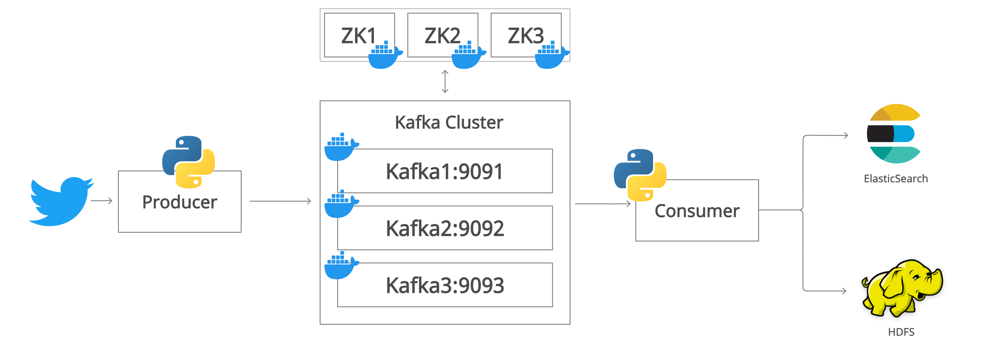

# **Kafka를 활용한 실시간 Twitter log 데이터 분석 및 시각화**

## **Overview**

이번 프로젝트에서는 로컬 환경에서 docker를 사용하여 Kafka Cluster를 구성하였습니다. 이전에 구축하였던 온/습도 센서 데이터를 실시간으로 받아서 처리하는 파이프라인에서는 데이터 파이프라인의 복잡도가 증가(`Kinesis data stream의 producer와 consumer가 증가`)됨에 따라 발생될 수 있는 문제로, Kinesis data stream 서비스 사용에 대한 비용증가 문제가 있었는데, 그 해결책으로 `직접 Kafka를 구축해서 운영`하거나 `AWS의 MSK(Kafka 완전 관리형) 서비스를 사용하여 관리 및 운영`하는 해결책에 대해서 정리를 했었는데, 이번에는 그 중에서 직접 Kafka를 로컬 환경에서 직접 구축하여 실시간 로그 데이터 처리 및 모니터링 할 수 있도록 구성해보았습니다. 

consumer는 두 그룹으로 나누어 Group A는 분석 및 시각화를 할 수 있도록 ES에 데이터를 적재하고 Kibana를 통해 데이터를 시각화하며, Group B는 데이터를 백업할 용도로 Hadoop의 HDFS에 데이터를 백업할 수 있도록 구성하였습니다.

## **Dataset**

프로젝트에서 사용하게 될 데이터는 Twitter API로부터 취득한 로그 데이터를 사용할 것 입니다. 

## **Objective**

이번 프로젝트를 통해서 데이터셋을 분석 및 시각화를 통하여 아래의 내용들에 대해 확인해볼 것 입니다.

- 
- 

<br/>

## **Data Architecture**



### **(1) Kafka를 선택한 이유**

이번 프로젝트에서 docker를 사용하여, 로컬 환경에 Kafka cluster를 구성한 이유는 Kafka 자체가 고가용성(HA)을 잘 지원해주기 때문에 실시간 데이터 처리 파이프라인 구성에 있어 중요한 역할을 해주기 때문입니다.

Kafka 클러스터에는 복수 개의 broker가 존재 할 수 있으며, Replication 옵션 값을 통해 각 topic의 partition들을 다른 broker에 ISR 그룹의 형태로 Leader와 Follower로 나뉘어 데이터를 복제하여 관리할 수 있습니다. 이로인해 앞에서 언급한 고가용성이 보장됩니다. 

물론 AWS의 Apache Kafka 완전 관리형 서비스인 MSK를 사용하면, 별도의 관리 리소스가 불필요하기 때문에 관리 비용이 절감된다는 장점이 있지만, MSK도 오픈 소스 프로젝트인 Kafka를 기반으로한 서비스이기 때문에 직접 운영을 하면서 내부적으로 어떻게 동작을 하는지에 대한 이해가 반드시 필요하다고 생각했고, 향후에 서비스가 확장됨에 따라 서비스 이용에 대한 비용절감을 위해서 온프레미스 환경에 Kafka를 직접 구축하여 관리 및 운영을 할 수 있을 수도 있다고 생각되어 직접 구축하여 관리 및 운영해 보았습니다. 

### **(2) Consumer를 2개로 구성한 이유**

Kafka의 장점 중 하나는 Partition의 데이터를 consumer에서 읽어도 데이터가 사라지지 않고, 지정한 retention 기간 및 시간까지 데이터가 유지된다는 점입니다. 
이로인해 같은 Topic에 물려있는 복수 개의 consumer를 각기 다른 group으로 설정하거나 `auto.offset.reset=earliest`로 설정하게 되면, 각 각의 consumer group별로 topic의 데이터를 처음부터 새로 데이터를 받아서 처리할 수 있습니다. 

이러한 Kafka의 장점을 보여주기 위해 하나의 topic에 서로 다른 consumer gruop에 속하는 두 개의 consumer를 구성하여 데이터 재처리가 가능하도록 하였습니다. 

## **Data Visualization**


## Prerequisites

Directions or anything needed before running the project.

- Docker Desktop 설치
- 코드를 실행할 IDE (VSCODE, Sublime Text 등) 준비

## How to Run This Project 

1. Docker Desktop이 실행 상태인지 확인
2. Terminal에서 프로젝트 폴더 중 `kafka-cluster`폴더의 위치로 이동하고, 아래의 명령을 실행
    ```zsh
    $docker-compose up -d
    ```
3. 우선 Python 스크립트 실행에 필요한 패키지를 설치
    ```zsh
    $pip3 install kafka-python
    $pip3 install python-twitter
    $pip3 install tweepy
    $pip3 install python-dotenv
    ```
4. .env 파일 작성
    ```zsh
    access_token = "[twitter access token]"
    access_token_secret = "[twitter access token secret]"
    api_key = "[twitter api key]"
    api_secret = "[twitter api secret key]"
    bootstrap_servers_ip = "[localhost ip addr]"
    
    (이하 생략)
    ```
3. 작성한 producer Python script를 실행 (프로젝트 디렉토리의 `kafka-producer/producer.py 및 kafka-consumer/consumer.py`파일)
    ```zsh
    $python3 kafka-producer/producer.py
    $python3 kafka-consumer/consumer.py
    ```


## Lessons Learned

It's good to reflect on what you learned throughout the process of building this project. Here you might discuss what you would have done differently if you had more time/money/data. Did you end up choosing the right tools or would you try something else next time?

## Contact

Please feel free to contact me if you have any questions at: LinkedIn, Twitter


```zsh
kafka.errors.UnrecognizedBrokerVersion: UnrecognizedBrokerVersion
```
solution)
https://stackoverflow.com/questions/58640045/kafka-python-raise-unrecognizedbrokerversion-error

```zsh
kafka.errors.KafkaTimeoutError: KafkaTimeoutError: Failed to update metadata after 60.0 secs.
```
예상할 수 있는 문제 : broker에 연결이 안되는 상황

localhost 환경에서 docker의 broker로부터 consume이 안되었던 이슈

localhost나 127.0.0.1로 지정하는 경우, multiple brokers 환경을 구성해서 kafka를 사용할 수 없다.

https://hub.docker.com/r/wurstmeister/kafka/
